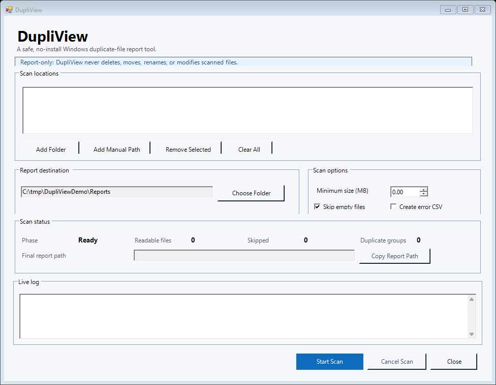

# DupliView

A safe, no-install Windows duplicate-file report tool.

DupliView helps people find exact duplicate files in selected folders, drives, or shared locations. It scans by file size first, hashes only possible matches with SHA-256, then writes duplicate groups to a CSV report.

DupliView is report-only. It never deletes, moves, renames, overwrites, uploads, or modifies scanned files.

## Screenshot

The refreshed window keeps scan locations, report destination, scan options, scan status, and the live log on one screen.



More screenshots are in [DupliView screenshots](docs/SCREENSHOTS.md).

## Safety Guarantee

DupliView is intentionally limited to reporting. During a scan, it reads file metadata and file contents needed to compute hashes, then writes CSV reports to the selected export folder.

DupliView never:

- Deletes scanned files.
- Moves scanned files.
- Renames scanned files.
- Overwrites scanned files.
- Uploads files.
- Modifies scanned files.
- Requires administrator rights.
- Installs services, scheduled tasks, registry entries, or executables.

The app also avoids "open folder" shortcuts that launch other programs. When a scan finishes, use `Copy Report Path` if you need the report location.

## Features

- No install required.
- Runs through a `.cmd` or `.bat` launcher.
- Clean Windows Forms interface with one main screen.
- Supports folders, drives, mapped drives such as `L:\`, and UNC paths such as `\\server\share`.
- Keeps one scan-location entry when the same folder is added again with different trailing slashes.
- Live status for current phase, readable files, skipped files, duplicate groups, and final report path.
- Live log that shows each scan step.
- Scan options for minimum file size, empty-file handling, and optional error CSV output.
- Background scanning so the window stays responsive during longer scans.
- Finds exact duplicates by size plus SHA-256 hash.
- Exports duplicate groups to CSV for Excel review.
- Optional error CSV for unreadable or failed-hash files.
- Keeps existing reports by adding a numeric suffix when a report filename already exists.

## Requirements

- Windows 10 or Windows 11.
- Windows PowerShell 5.1 or newer.
- Read access to the folders being scanned.
- Write access to the selected export folder.
- No administrator rights required.

## How To Run

1. Download or clone the repository.
2. Open the DupliView folder.
3. For release ZIPs, read `START HERE.txt`.
4. Double-click `Run DupliView.cmd`.
5. If needed, use `Run DupliView.bat` instead.

The launchers run:

```cmd
powershell.exe -NoProfile -STA -ExecutionPolicy Bypass -File "%~dp0DupliView.ps1"
```

`-ExecutionPolicy Bypass` applies only to that one run.

## How To Scan

1. Click `Add Folder`.
2. Choose one or more folders or drives.
3. Use `Add Manual Path` for mapped drives or UNC paths.
   If you add the same location again with a trailing-slash difference, DupliView keeps one entry.
4. Keep the default `Reports` folder or choose an existing export folder.
   DupliView creates the default `Reports` folder when the scan starts. If the DupliView folder is read-only, click `Choose Folder` and pick another writable location.
5. Adjust scan options if needed.
6. Click `Start Scan`.
7. Watch the scan status and live log.
8. Use `Cancel Scan` if you need to stop a long scan before it finishes.
   The status changes to `Stopped`; rerun the scan later if you need a complete report.
9. Use `Copy Report Path` if you need to paste the report location elsewhere.
10. Open the saved CSV report in Excel.

## Scan Options

- `Minimum size (MB)`: skips files smaller than the selected size.
- `Skip empty files`: skips zero-byte files when checked.
- `Create error CSV`: writes a separate CSV for unreadable files or failed hash attempts when errors occur.

The defaults are meant for normal use. You can scan without changing them.

## Status And Log

The status area gives a quick summary:

- `Phase`: what DupliView is doing now.
- `Readable files`: files that passed the selected filters.
- `Skipped`: unreadable files plus files skipped by the empty-file and minimum-size options.
- `Duplicate groups`: groups of matching files found in this scan.
- `Final report path`: where the CSV was saved.

The live log gives the step-by-step record. It is useful for long network-drive scans where the file count can be large.

## How To Read The CSV

Each row is one file that belongs to a duplicate group. Rows with the same `DuplicateGroup` value have identical file content according to the configured hash algorithm.

Review duplicate groups manually. DupliView does not decide which file to keep and does not perform cleanup.

## CSV Columns

- `DuplicateGroup`: Stable group label within one report, such as `Group001`.
- `GroupFileCount`: Number of files in that duplicate group.
- `RootScanned`: Selected root folder that produced the file.
- `DriveOrSource`: Drive letter such as `L:` or a readable network share root.
- `FileName`: File name only.
- `FileExtension`: File extension such as `.pdf`, `.docx`, or `.xlsx`.
- `FolderPath`: Folder containing the file.
- `FullPath`: Full path to the file.
- `SizeBytes`: File size in bytes.
- `SizeMiB`: File size in mebibytes, rounded to 2 decimal places.
- `Hash`: SHA-256 content hash by default.
- `LastModified`: Last write time reported by Windows.
- `ExportedAt`: Date and time the report rows were created.

## Configuration

The current script keeps defaults inside `DupliView.ps1` near the top:

```powershell
$MinimumSizeMB = 0
$SkipEmptyFiles = $true
$CreateErrorLog = $false
$DefaultReportFolderName = 'Reports'
$HashAlgorithm = 'SHA256'
$ReportOnlyMode = $true
$CsvColumns = @(...)
```

Normal users do not need to edit these settings.

The GUI exposes the common options directly. The script configuration remains useful for maintainers who want to change defaults before sharing the tool with a team.

## Known Limitations

- Large network drives may take a long time.
- The user must have permission to read files.
- Locked or unreadable files may be skipped.
- Files that change while a scan is running may produce stale results.
- This finds exact duplicates, not similar photos or fuzzy matches.
- There are no deletion or cleanup features.

## Tutorials And Guides

The full documentation starts at [DupliView Documentation](docs/README.md).

User guides:

- [First Scan](docs/guides/first-scan.md)
- [Network Drive Scan](docs/guides/network-drive-scan.md)
- [Read The CSV](docs/guides/read-the-csv.md)
- [Skipped Files And Errors](docs/guides/skipped-files-and-errors.md)
- [Share With Coworkers](docs/guides/share-with-coworkers.md)
- [Troubleshooting](docs/guides/troubleshooting.md)

## Development And Testing

Production use does not require Pester. Tests use Pester for development.

The current test suite is written for Windows PowerShell 5.1 and Pester 4.10.1. GitHub Actions pins that version so CI matches the local Windows target.

Run tests from the repository root:

```powershell
Import-Module Pester -RequiredVersion 4.10.1 -Force
Invoke-Pester -Script .\tests\DupliView.Tests.ps1 -EnableExit
```

If Pester is not installed, install it for development only:

```powershell
Install-Module Pester -RequiredVersion 4.10.1 -Scope CurrentUser
```

The test suite creates temporary folders and files under the system temp directory and removes only those temporary test folders.

Before changing the GUI or docs, run the tests and check that the safety scan still passes.

GitHub Actions also runs the Pester suite on Windows for pushes and pull requests.

## Create A Release ZIP

Maintainers can build the release ZIP from a clean checkout:

```powershell
.\tools\New-ReleasePackage.ps1 -Version 0.2.0
```

The script writes `dist\DupliView-0.2.0.zip` and `dist\DupliView-0.2.0.zip.sha256`. The ZIP is source-inclusive: it includes the user-facing files, source, tests, maintainer docs, screenshots, packaging script, and `Reports\.gitkeep`; it does not include generated CSV reports, old ZIPs, `.git`, or local temp files. Normal users can ignore the developer files and start with `START HERE.txt`.

## License

DupliView is licensed under the MIT License. See `LICENSE`.
