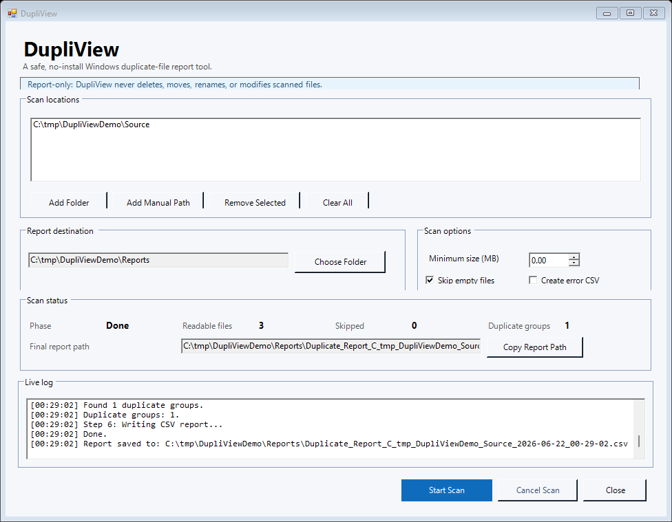

# DupliView screenshots

The DupliView window is a single-screen Windows Forms utility.

## Main window

The main window keeps the scan locations, report destination, scan options, status summary, and live log on one screen. The default `Reports` folder is created when a scan starts, not when the window opens.

## Completed scan

A completed scan shows readable files, skipped files, duplicate groups, the final report path, and recent log messages.

## What this does not do

The interface shown here does not include cleanup actions. DupliView does not delete, move, rename, overwrite, upload, or modify scanned files.
